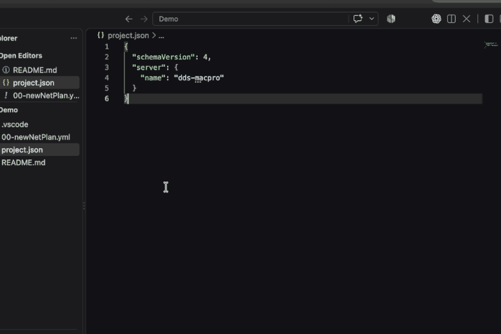

# 📝 Panel Notes

Keep Markdown notes and READMEs right in the VS Code panel.

README previews are no problem on large screens or when you're mainly reading, but on smaller screens there are times when you just want a quick reference without moving away from the screen you're already on.

Use `Cmd + J` on macOS or `Ctrl + J` on Windows/Linux to flip the panel up, grab a quick command or reference, then hide it again without breaking your flow.

Panel Notes gives you fast access to the Markdown files you actually use without digging through the Explorer every time.



## How It Works

1. Open any Markdown file in your workspace.
2. Panel Notes automatically adds it to `.vscode/panel-notes.json`.
3. Open the **Panel Notes** tab in the VS Code panel.
4. Click any saved Markdown file to view it directly in the panel.
5. Use **Clear** whenever you want to reset the list.

Files that no longer exist are automatically removed when VS Code starts or when the extension restarts.

## Features

- Automatic Markdown discovery based on files you actually open
- Persistent workspace-specific note list
- Markdown rendering directly inside the VS Code panel
- Syntax-highlighted code blocks
- Copy buttons on code blocks
- Per-document scroll-position memory
- Automatic cleanup of deleted files
- One-click Clear button
- Zero manual configuration required

## Configuration

Panel Notes automatically creates:

```text
.vscode/panel-notes.json
```
---
---

Since this extension is open source, you can find it [here](https://github.com/Dreblow/PanelNotes)

## Roadmap

Panel Notes v0.1.0 focuses on one thing: making Markdown files in a workspace easy to access from the VS Code panel.

Here are some ideas to come:

### File Discovery & Refresh 

- [ ] Better empty-state UI when no Markdown files exist

### Organization & Navigation

- [ ] Custom ordering of notes
- [ ] Pin favorite notes to the top
- [ ] Group notes by directory
- [ ] Recently opened notes
- [X] Remember the last opened note

### Configuration

- [ ] Optional manual entries in `panel-notes.json` wont be over written when auto search does its thing.

### Additional Content Types

- [ ] HTML note support
- [ ] Plain-text note support
- [ ] Additional document types based on user feedback

### Accessibility & Polish

- [ ] General UI polish based on user feedback
---

## Development Setup

Install the project dependencies:

```bash
npm install
```

If you add new dependencies, install them through npm so they are recorded in `package.json` and `package-lock.json`.

For example:

```bash
npm install markdown-it
npm install --save-dev @types/markdown-it
```

## Build

Compile the TypeScript source:

```bash
npm run compile
```

## Package the VS Code Extension

Create a local `.vsix` package for testing:

```bash
npx @vscode/vsce package
```

This will create a file similar to:

```text
panel-notes-0.1.0.vsix
```

## Install the Test Package

Install the generated extension package into VS Code:

```bash
code --install-extension panel-notes-0.1.0.vsix --force
```

Then reload VS Code to test the newly installed version.

The `--force` option is useful during development because it replaces the currently installed version with the newly packaged build.


## One Stop Shop for QA

```bash
npm run compile && npx @vscode/vsce package && code --install-extension panel-notes-0.1.0.vsix --force && osascript -e 'tell application "Visual Studio Code" to quit'
```
